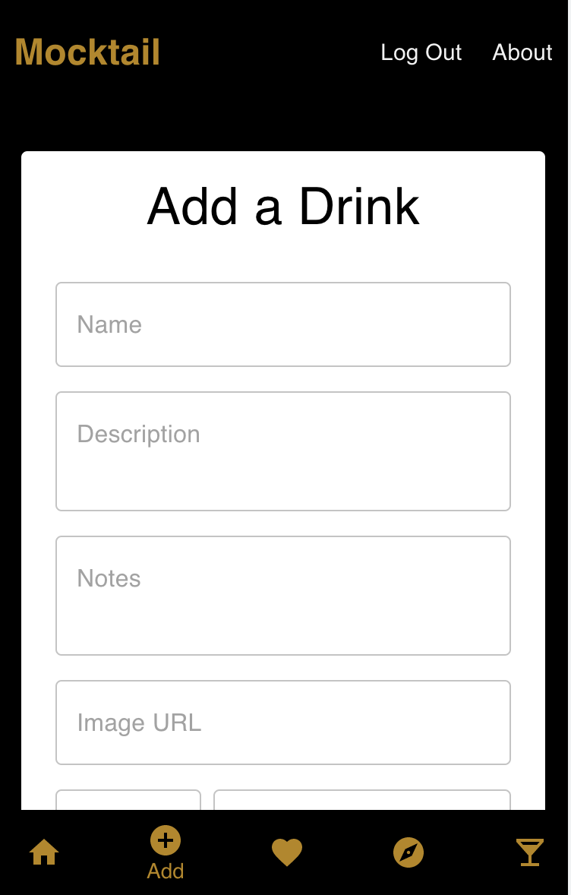

# Mocktail App

## Description

_Duration: 2 Week Sprint_

Mocktail is an app for craft mocktail recipes.  There are plentiful alcoholic drink apps in the market but hardly anything focusing specifically on non-alcoholic drinks.  I created this app to fill that need.

Mocktail gives the user the ability to add their own recipes, discover recipes from other users and to update the recipes when they find their own specific twist.  The app also allows users to input ingredients they currently have at home.  It then suggests recipes they can make based on those ingredients!

## Screen Shots

### Prerequisites

- Node.js

## Installation

Visit the fully deployed app [here](https://infinite-spire-78403.herokuapp.com/#/user)

Note: The app is currently best viewed in a mobile size. Please re-size your page for best results!

Run it locally:

- Clone this repository from Github
- Create a database titled "prime_app" and create the tables using the initializer data found in database.sql
- Run npm install in your terminal to download the necessary modules
- Run npm run client to start React
- In a separate terminal, run npm run server to start the server
- Visit http://localhost:3000 in your browser to view the project!

## Built With

1. React
2. React-Redux
3. Redux-Saga
4. Material UI (MUI)
5. Express.js
6. Node.js
7. PostgreSQL
8. Axios
9. HTML/CSS
10. Cloudinary

## Acknowledgement
Thanks to [Prime Digital Academy](www.primeacademy.io) who equipped me with the skills needed to make this application a reality. 

## Support
If you have suggestions or issues, please email me at [samcfreeman888@gmail.com](samcfreeman888@gmail.com)